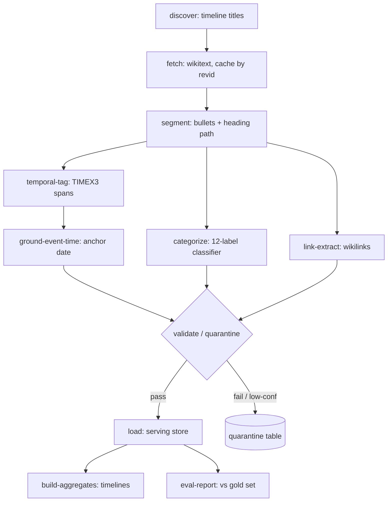

# RFC: Chronicle Pipeline v2

- **Status:** Draft
- **Date:** 2026-06-19
- **Author:** Jose Smiller
- **Supersedes:** the v1 scraper (`scraper/` — Node CLI, 4 coupled stages, single 3B LLM)

---

## 1. Context

The v1 pipeline scrapes Wikipedia "Timeline of…" articles and normalizes them into
historical `Event` documents via a single local LLM (`llama3.2:3b`) call per batch.
It works end-to-end but produces data that is "plausible but wrong" often enough to
be untrustworthy, and — more importantly — **there is no way to measure how wrong it
is**, because there is no ground truth and no quality instrumentation.

This RFC proposes a v2 architecture: an orchestrated ETL that decomposes
"normalization" into separable sub-tasks, assigns the right model class to each,
enforces data contracts and confidence-based quarantine between stages, and is
measured against a hand-labeled gold set on every run.

## 2. Problem statement

### 2.1 The canonical failure (grounded in real data)

```
source heading: "17th century"
source bullet:  "1650 Bishop James Ussher calculates date of creation as October 23, 4004 BC"

v1 output:      year = -4004, yearDisplay = "October 23, 4004 BC"
correct:        year =  1650  (event occurred in 1650; 4004 BC is the *content* of the calculation)
```

The event **happened in 1650 AD**. The model anchored it to the most salient date in
the sentence (4004 BC) rather than the date the event occurred. This is not a parsing
bug — it is a **semantic temporal-grounding** failure: choosing *which* of several
dates in a sentence is the event anchor.

### 2.2 Failure taxonomy

| Class | Example | Root cause | Tractable by rules? |
|---|---|---|---|
| Mechanical date errors | "777 Cumae" → +777; `year: 0` | LLM weak at sign / propagation / formatting | Yes (done in v1 via `utils/resolveDate.js`) |
| **Semantic temporal grounding** | Ussher 1650 → 4004 BC | which date is the event anchor? | No — needs structural prior + learned tail |
| Empty `wikiLink` | most events | LLM asked to *guess* an article title | Yes — extract `[[wikilinks]]` deterministically |
| Junk events | rows from `See also` / `References` | no section-type filter | Yes — contract + gate |
| **No quality system** | can't answer "is it better?" | no contracts, gates, lineage, or eval set | Architectural |

### 2.3 The two structural problems

1. **The pipeline conflates "a date mentioned in the text" with "when the event
   happened."** For ~90% of timeline bullets these coincide (Wikipedia's "DATE: event"
   convention), so naive extraction looks fine until they diverge (Ussher; "In 1969 a
   museum opened an exhibit on the 1789 storming of the Bastille").
2. **One model does five jobs** (segmentation, date extraction, date grounding,
   categorization, entity linking, summarization). Every job is mediocre and none can
   be measured, improved, or trusted independently.

## 3. Goals / non-goals

**Goals**
- Each output field is produced by the *right* tool and is independently measurable.
- Separate date **extraction** from date **grounding**.
- Data contracts + confidence-based quarantine at every stage boundary.
- Full lineage to the source Wikipedia revision.
- A gold eval set and an eval harness reporting per-field accuracy every run.
- Idempotent, incremental, observable orchestration.

**Non-goals**
- Real-time updates (batch is fine).
- General-article extraction (still "Timeline of…" only).
- Replacing MongoDB as the serving store.

## 4. Design principles

1. **Right tool per task** — rule-based tagger for dates, encoder-classifier for
   categories, deterministic extraction for links; reserve generative inference for
   description polish and low-confidence adjudication only.
2. **Deterministic-first** — anything regular (wikitext structure, links, sign/era)
   is computed, not predicted.
3. **Confidence is a first-class field** — every field carries a confidence; low
   confidence routes to quarantine, not to users.
4. **Measure or it didn't happen** — no stage ships without an eval metric.
5. **Lineage everywhere** — event → bullet → article → revision id.

## 5. Task decomposition

| Sub-task | v1 | v2 | Rationale |
|---|---|---|---|
| Segmentation | LLM | structure-aware wikitext AST parser | wikitext is structured; parsing is solved |
| Date extraction (all TIMEX) | LLM | **rule-based temporal tagger** (HeidelTime / SUTime / Duckling) → TIMEX3 | battle-tested, evaluated, handles circa/range/kya/relative |
| **Event-time grounding** | implicit | **structural prior + small learned classifier for the ambiguous tail** | the Ussher problem |
| Category (12-label) | LLM | **fine-tuned encoder** (DeBERTa-v3) or embeddings + logistic regression | fixed taxonomy → classification, calibrated, fast |
| `wikiLink` / entity | LLM (empty) | **deterministic `[[wikilink]]` extraction** + entity-linking fallback | editors already linked the entities |
| Title / description | LLM generative | extractive cleanup, or constrained small summarizer | avoids hallucination |

### 5.1 On "SLM vs LLM"

The right move is not "a smaller LLM" but "the right model *class* per task":

- A **rule-based temporal tagger** beats any LLM on dates (and is evaluable).
- A **fine-tuned encoder** (~100–400M params) on a multi-label head beats a 3B decoder
  on the 12-category task — faster, deterministic, with calibrated probabilities you
  can threshold.
- Reserve a **generative model** (local SLM or API LLM-as-judge) for exactly two
  things: (a) polishing descriptions, (b) adjudicating records the deterministic
  stages flag as low-confidence. This is the core cost/quality lever — expensive
  inference only where it's needed.

### 5.2 Event-time grounding (the Ussher fix), in tiers

1. **Structural prior (free, high precision):** the leading date token of a timeline
   bullet, or the date in the nearest ancestor heading, is the event anchor. Fixes
   Ussher (1650 leads the bullet) and the 49 month-only French Revolution events
   (year lives in an ancestor heading v1's parser never captured).
2. **Token-classification model for the tail:** fine-tune a small encoder to tag the
   anchor date in multi-date sentences (temporal relation extraction).
3. **LLM-as-judge** only where (1) and (2) disagree or score low.

## 6. Architecture

### 6.1 Asset DAG



### 6.2 Cross-cutting requirements (all missing in v1)

- **Data contracts** at every boundary (Pydantic/Pandera). A stage rejects malformed
  input rather than propagating it. See `pipeline-v2/contracts.py`.
- **Validation gates + quarantine.** Records failing checks (`year > current_year`,
  BC event in an AD-only article, `source_section ∈ {References, See also}`, per-field
  confidence below threshold) go to a quarantine table for review — not the serving
  collection. The Ussher record (multi-date sentence, low grounding confidence) is
  quarantined rather than shipped.
- **Per-field confidence scores** consumed by both the gate and the UI.
- **Lineage**: every event → bullet → article → Wikipedia revision id. Reproducible
  re-runs against a frozen snapshot.
- **Incremental + idempotent by content hash** — re-fetch only changed revisions,
  re-run only affected downstream assets.
- **Observability** — run history, per-asset metrics, data-quality dashboards (row
  counts, null rates, date distribution over time).

### 6.3 Storage

Keep **MongoDB as the serving store**. Add a **staging layer** (Parquet + DuckDB, or
Postgres) for analytical/QA work — schema validation, eval joins, distribution checks.
Do not do data-quality work in the serving DB.

## 7. Orchestrator choice

| Option | Fit | Verdict |
|---|---|---|
| Argo Workflows | powerful, but needs Kubernetes; heavy ops for a single-machine / free-tier project | only if showcasing k8s/Argo is itself a goal |
| **Dagster** | asset-based, local-first, native lineage + asset checks + typed IO, good UI | **recommended** |
| Prefect | lighter, Pythonic, good retries/observability, less lineage tooling | solid middle ground |
| Airflow | task-centric (not data-aware), clunky local DX | skip |

**Recommendation:** Dagster — its asset model and built-in asset checks make the
quality gates fall out naturally; the whole pipeline moves to Python, unlocking the
mature NLP stack (HeidelTime, spaCy, HF transformers, scikit-learn) absent in Node.
Use Argo only if demonstrating k8s orchestration is an explicit objective — it changes
*who runs the DAG*, not whether the *data* is correct.

## 8. Training data (the bootstrap)

- **Weak supervision:** the deterministic extractors (temporal tagger + structural
  prior + wikilink extraction) generate *silver* labels at scale, for free.
- **Gold eval set:** hand-label **300–500 events**, stratified across articles/eras.
  Highest-ROI artifact in the project — without it "better" is unmeasurable. Schema:
  `pipeline-v2/gold_event.schema.json`.
- **Train SLM on silver, validate on gold.** Distill extra labels from an API LLM for
  ambiguous cases. Result: a small, fast, *evaluated* model instead of an unmeasured
  3B black box.

## 9. Evaluation harness

First deliverable of v2. Per-field metrics against the gold set, reported every run:

| Field | Metric |
|---|---|
| event year | exact-match rate; within-tolerance rate (±1 yr / ±decade for circa) |
| date precision | accuracy |
| category | multi-label F1 (micro + per-class) |
| wikiLink | precision / coverage |
| anchor grounding | accuracy on the multi-date subset (the Ussher slice) |

This converts the project from "looks plausible" to "94% date exact-match, 0.89
category F1" — the difference between a hobby scraper and a data pipeline.

## 10. Phasing

- **Phase 1 — Quality foundation (highest ROI, low effort):** gold eval set;
  Pydantic contracts + validation/quarantine gate; temporal tagger replaces regex;
  deterministic wikilink extraction; structural grounding prior. Fixes Ussher,
  `year: 0`, and empty wikiLinks — measurably. Sketch: `pipeline-v2/assets_sketch.py`.
- **Phase 2 — Orchestration:** port to Dagster assets with lineage, revid caching,
  asset checks, data-quality dashboard.
- **Phase 3 — Learned components:** fine-tune the category classifier and the
  grounding tail model on silver+gold; route only low-confidence records to an LLM
  judge.

## 11. Risks / open questions

- **Temporal tagger coverage** for deep-time / "kya" / regnal dates — may need custom
  TIMEX rules. Mitigation: keep the v1 deterministic resolver as a fallback.
- **Grounding training data volume** — the multi-date tail may be small; distillation
  from an LLM judge may suffice without a custom model. Validate before investing.
- **Gold-set labeling effort** — 300–500 events is a real time cost; could bootstrap
  initial labels from the (now-repaired) v1 data and hand-correct.
- **Scope creep** — Argo/k8s, custom models, and a full Dagster deployment are each
  optional; Phase 1 alone delivers most of the quality gain.

## 12. Appendix — build artifacts

- `pipeline-v2/contracts.py` — Pydantic data contracts for each stage boundary.
- `pipeline-v2/assets_sketch.py` — Phase-1 Dagster asset graph (illustrative).
- `pipeline-v2/gold_event.schema.json` — gold eval-set record schema + example.
